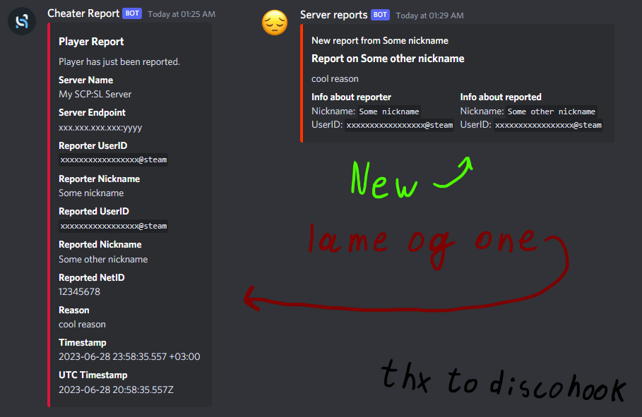

# unreasonablemicroservice
Simple microservice to make SCP: Secret Laboratory webhook server reports a little bit better

# what gives

# but why though?
well someone said that this is just, you know, \*impossible\*, since you can't really adjust webhook json via server configs, as it is hardcoded inside the game

oh and also it looks much better in my opinion

---

*generally this project is just a PoC*  
*I mean, it might/should work just fine in proper enviroment, but you know, THIS SOFTWARE IS PROVIDED "AS IS"*
